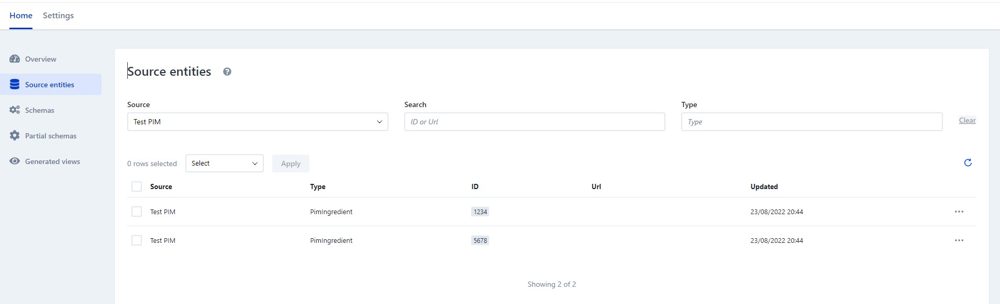

# Enterspeed Ingestion example

This example shows you how simple it can be to ingest data from your PIM.

## Requirements

If don't have .NET 6, go and get it from here:
[.NET 6 - Microsoft](https://dotnet.microsoft.com/en-us/download/dotnet/6.0)

## Before starting

1. Go to Enterspeed and create an account and a tenant. Create an account here: [Enterspeed](https://enterspeedmanagement.b2clogin.com/enterspeedmanagement.onmicrosoft.com/oauth2/v2.0/authorize?client_id=134bf41c-9879-4e8a-b7ba-909adfffc384&nonce=defaultNonce&scope=openid%20offline_access&response_type=code&p=B2C_1_default&redirect_uri=https%3A%2F%2Fapp.enterspeed.com%2Fauthentication)
2. Go to "Settings" -> "Data sources" and create a new source

You can see the docs here: [Adding data source](https://docs.enterspeed.com/getting-started/data-sources)

## Running the application

In the Startup.cs copy the API Key from your data source and paste it as a string
into the `ApiKey` property.

Now run the application.

### Calling the endpoint

Call the following to ingest some sugar:
```
curl --request POST \
  --url http://localhost:7233/api/ingest \
  --header 'Content-Type: text/json' \
  --data '{
	"ingredientId": "1234"
}'
```

### Validation

If everything went as expected, you should see your entity ingested in Enterspeed.

